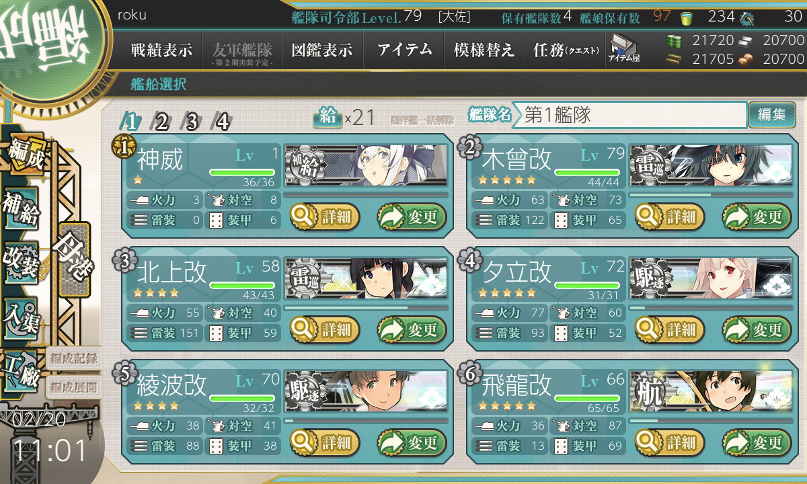

Name:   Barep Bimo Pangestu
NRP:    05111540000112

# Examples of bad design

## 1. Kantai Collection (game)

Kantai Collection is a Japanese browser game released in 2013. The main premise of the game is to collect fleet girls (kanmusu) and using them to fight the abyssal fleet.

The interface in the game is mostly alright but in my opinion, there is one thing there is one thing in the design that annoys me and that is

the lack of quick button for battle menu in the sidebar. Most of what the players will be doing is sending their fleets to sortie, and then repairing them and sometimes changing the fleet's formation. The lack of said button means that after going through repair screen and sommetimes, fleet formation screen (both available in the sidebar), means the player must return to the main menu everytime to send fleets to sortie. It's not something very critical that renders the game unplayable but if they added the button, the overall experience of the game would be much more pleasant.

## 2. Azur Lane (game)

Azur Lane is a mobile game first released in 2017 in China. They gradually expand their servers since then and finally made the game available worldwide in 2018. It's a side-scrolling shmup game set in alternate timeline of WWII. The players will control a fleet of shipgirls (moe antropomorphic interpretation of warships) and use them to fight enemies ships.

The game's interface is good for a mobile game but there are few bad design that makes the experience less satisfying.

### Confirmation buttons' position

In the game, the player can do somethings like scrapping gears or retiring unneeded shipgirls. After selecting the gears to be scrapped, the game will show a confirmation pop-up for the player. I don't know about other players experience but in my case, there are many times where I tapped outside the pop-up windows instead of the ok button, even though I tapped the ok button. My suspicion is that the actual size of the button is smaller than what the game shows, therefore they read my action as tapping outside the window to close the pop-up instead of confirming my actions. This is pretty annoying in my opinion because that means I have to tap scrap button again and then selecting the confirm button properly, which requires my concentration. It should be noted that most of the time I play this game as a companion to my other activities that requires concentration like doing assignments, reading study material or playing games in my laptop.

### Lack of auto quest progression

This game have many quests for players to complete. Most of time I play this game just to complete the daily quests. Some of these quests are locked until you finish other daily quests. For example, the "Finish a battle with rating A or better" quests can only be done after the player finished "Finish a battle" quest. The bad thing about this is the game won't automatically unlock the next quest after you completed the requirements. Instead the player must take the quest reward first before the game shows the quest. This is annoying because the player must return to the main menu screen and select the quest menu everytime after they finished a battle to open a new quest or they will not be rewarded for they hard work. The game would be much better if it have an auto quest progression like the one in Girls' Frontline, or maybe to have the quest button available in the battle map screen so the player won't need to return all the way to the main screen.

